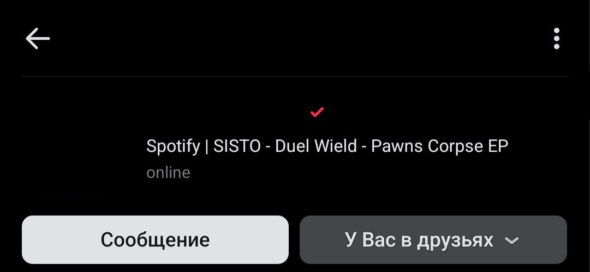
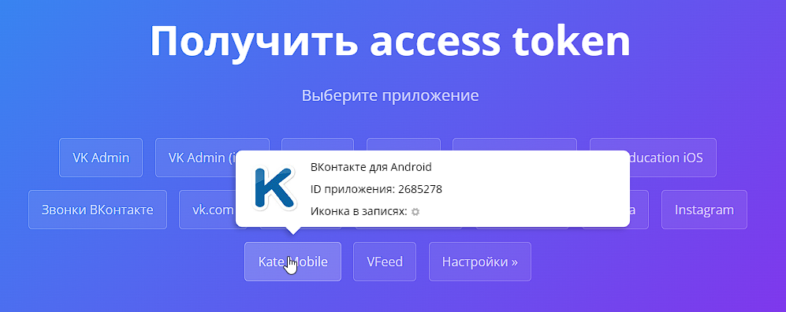
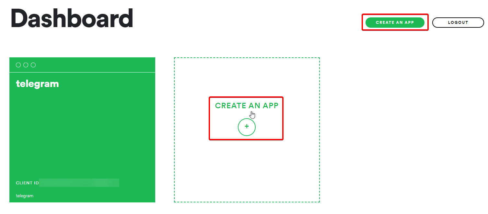
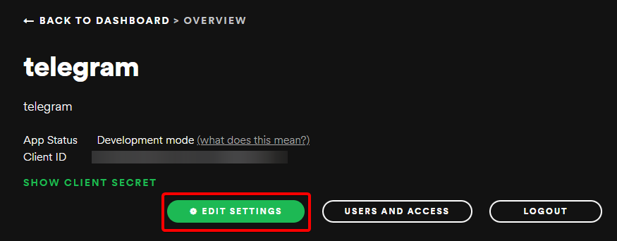
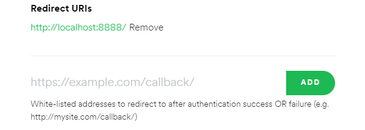
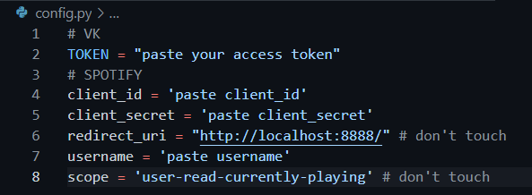

# Spotify to VK Bio

> **⚠️ This project is no longer maintained or updated, as I no longer use VK.  
> Please check out my Telegram version instead: [spotify-to-telegram](https://github.com/L4zzur/spotify-to-telegram)**

Display your currently playing Spotify song in your VK bio.


## Installation

1. Clone the repository:
```bash
git clone https://github.com/L4zzur/spotify-to-vk.git
```

2. Navigate to the "spotify-to-vk" directory:
```bash
cd spotify-to-vk
```

3. Install the required dependencies:
```bash
pip3 install -r requirements.txt
```

## Configuration
### VK:

1. Go to [vkhost.github.io](https://vkhost.github.io/)
2. Select "Kate Mobile".

3. Authorize access using your VK account.
4. Copy the part of the URL from `access_token=` up to `&expires_in`.
> Never share these tokens with anyone.

### Spotify
1. Go to the [Spotify Dashboard](https://developer.spotify.com/dashboard/).
2. Log in and create a new application.

3. Open your newly created application, then go to its settings.

4. Set the Redirect URI to `http://localhost:8888/callback`.

> Never share these tokens with anyone.

### Python
1. Change to the script directory (as in step 2 of Installation).
2. Run the setup script:
```bash
python3 setup.py
```
3. Enter all the required information obtained earlier when prompted by the script.
4. Authorize your Spotify application via the link provided by the script, or manually fill in the configuration in `config.py`.



## Running
1. Start the script:
```bash
python3 main.py
```
2. Enjoy!
